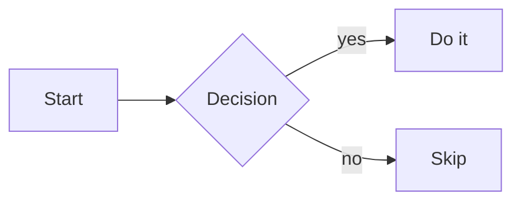

# markdown

> **Area:** [[Writing & Docs]]
> Syntax reference for CommonMark, the GitHub-flavored (GFM) extensions, and the Obsidian additions used in this knowledge base.

## 1. Headings

```markdown
# H1          ← one per document, the title
## H2         ← main sections
### H3        ← subsections; going deeper than H4 usually means restructure
```

Always put a blank line before and after a heading — some renderers refuse to recognize it otherwise.

## 2. Emphasis & inline

```markdown
*italic*        or _italic_
**bold**        or __bold__
***bold italic***
~~strikethrough~~            ← GFM
`inline code`                ← also protects literal *, _, [ from parsing
==highlight==                ← Obsidian only, not portable
```

## 3. Lists

```markdown
- unordered item             ← -, *, + all work; pick - and stay consistent
    - nested item            ← indent 4 spaces (2 works in most renderers)

1. ordered item
1. next item                 ← all-1 numbering auto-increments; renumbering-proof

- [ ] open task              ← GFM / Obsidian task list
- [x] done task
```

A list must be preceded by a blank line, or it renders as run-on prose — the single most common markdown bug.

To continue a paragraph or add a code block *inside* a list item, indent it to align with the item's text.

## 4. Links & images

```markdown
[link text](https://example.com)
[link with title](https://example.com "hover text")
<https://example.com>                ← autolink, shows the raw URL
[reference style][ref]               ← keeps prose clean in link-heavy text
[ref]: https://example.com


           ← Obsidian: cap width at 300px
[section link](#heading-text)        ← heading anchor: lowercase, dashes for spaces
```

## 5. Code

````markdown
`inline code` for commands, filenames, identifiers in prose.

```bash
# fenced block with language tag — always tag, it buys syntax highlighting
echo "hello"
```
````

To show a fenced block *inside* a fenced block, make the outer fence longer (four backticks) or use `~~~`.

## 6. Tables

```markdown
| Column     | Aligned right | Centered |
| ---------- | ------------: | :------: |
| plain cell |          42   |   yes    |
```

Alignment via colons in the separator row. Cells can't contain block elements — use `<br>` for a forced line break inside a cell. Padding for column alignment is cosmetic only.

## 7. Blockquotes, rules & line breaks

```markdown
> quoted text
> > nested quote

---                          ← horizontal rule; needs blank lines around it

line one␠␠                   ← two trailing spaces = hard line break
line two                     ← ...or end line one with a backslash \
```

A blank line ends a paragraph; a single newline inside a paragraph is *ignored* by strict CommonMark (but rendered as a break by Obsidian's default and many chat apps — don't rely on either).

## 8. Escapes & raw HTML

```markdown
\* \_ \# \[ \| \`            ← backslash-escape any punctuation markdown would eat
&lt; &amp;                   ← HTML entities work too
<kbd>Ctrl</kbd>+<kbd>C</kbd> ← inline HTML passes through in most renderers
```

Escape `|` as `\|` inside table cells and wikilink aliases in tables.

## 9. GFM extras

```markdown
Footnote reference[^1]
[^1]: The footnote text, anywhere in the file.

Automatic linking of bare URLs: https://example.com
```

## 10. Obsidian flavor (not portable)

```markdown
[[Note Name]]                ← wikilink, resolves within the open vault only
[[Note Name|shown text]]     ← aliased wikilink
[[Note Name#Heading]]        ← link to a heading
![[Note Name]]               ← embed (transclude) another note
![[image.png]]               ← embed an attachment
%%hidden comment%%           ← visible in source mode only

> [!note] Callout title      ← callouts: note, tip, warning, quote, ...
> Callout body.
```

On the public web these render as plain text — the reason this repo prefers naming concepts in prose over hard-linking across vaults.

Callouts take a type and can be collapsible; the type sets the icon and color:

```markdown
> [!tip] Optional title            ← types: note, tip, info, warning, danger,
> Body text, may contain **markdown**.   quote, example, success, question, bug, ...

> [!warning]- Folded by default    ← trailing "-" starts collapsed; "+" starts open
> Hidden until the reader expands it.
```

## 11. Math (MathJax / KaTeX)

Not CommonMark, but supported by Obsidian, GitHub, and most doc renderers via `$`:

```markdown
Inline: $E = mc^2$ and $\sum_{i=1}^{n} i = \frac{n(n+1)}{2}$

Display (own line, centered):

$$
\int_0^\infty e^{-x^2}\,dx = \frac{\sqrt{\pi}}{2}
$$
```

The body is [[latex]] math-mode syntax (§5 there). Escape a literal dollar sign as `\$` so it isn't read as a math delimiter.

## 12. Diagrams & collapsibles

````markdown

````

Mermaid fenced blocks render as diagrams in Obsidian and GitHub (flowcharts, sequence, class, gantt, state). For a native collapsible section on the public web, drop to HTML:

```markdown
<details>
<summary>Click to expand</summary>

Hidden content — remember a blank line after `</summary>` or the markdown inside won't parse.

</details>
```

## Daily workflows

```markdown
<!-- New note in this repo: copy the matching template, fill frontmatter -->
---
type: cheatsheet
area: writing
aliases: []
tags: []
status: stub
---
```

Frontmatter is YAML between `---` fences on the very first line — nothing may precede it, not even a blank line.

## Gotchas / Golden rules

- **Blank lines are structure.** Before/after headings, lists, code fences, tables, and rules. When rendering looks wrong, missing blank lines are the first suspect.
- **CommonMark requires a blank line before a list** — the classic "my bullets ran into the paragraph" bug.
- **Tabs vs spaces:** indent with spaces; a tab counts as 4 and mixing them breaks nested lists silently.
- **Numbered lists restart** if a paragraph without indentation interrupts them; indent the interruption to keep counting.
- **`#` needs a following space** to be a heading (`#tag` is an Obsidian tag, not an H1).
- **Trailing-space line breaks are invisible** in editors; prefer a backslash or a new paragraph.
- **Don't skip heading levels** (H2 → H4); linters and tables of contents choke on it.
- **Portability:** wikilinks, callouts, highlights, and embeds are Obsidian-only — fine inside a vault, lost on export.
- **`$` is a math delimiter** wherever MathJax/KaTeX is on — escape prices and shell vars as `\$` in prose.
- **`<details>` needs blank lines** around its inner markdown, or the content renders as literal HTML.

## Further reading

- [CommonMark Spec](https://spec.commonmark.org/) — the portable core, precisely defined
- [GitHub Flavored Markdown Spec](https://github.github.com/gfm/) — tables, task lists, strikethrough, autolinks
- [Obsidian: Basic formatting syntax](https://help.obsidian.md/syntax) — wikilinks, callouts, embeds, math
