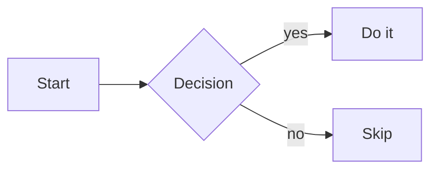

# markdown

> **Area:** [[Writing & Docs]]
> Syntax reference for CommonMark, the GitHub-flavored (GFM) extensions, and the Obsidian additions used in this knowledge base.
> Every syntax block is followed by the same snippet **rendered live** — open this note in Reading view and it doubles as a render test for the current theme. Elements stock Obsidian does *not* render are marked ⛔ and stay syntax-only.

## 1. Headings

```markdown
# H1          ← one per document, the title
## H2         ← main sections
### H3        ← subsections; going deeper than H4 usually means restructure
```

Always put a blank line before and after a heading — some renderers refuse to recognize it otherwise.

**Live** (quoted, so the samples stay out of the Outline pane and don't wreck this note's structure):

> ## H2 sample
> ### H3 sample
> #### H4 sample

Headings inside blockquotes render at full size but are excluded from Obsidian's Outline — which is exactly why the samples are quoted here.

## 2. Emphasis & inline

```markdown
*italic*        or _italic_
**bold**        or __bold__
***bold italic***
~~strikethrough~~            ← GFM
`inline code`                ← also protects literal *, _, [ from parsing
==highlight==                ← Obsidian only, not portable
```

**Live:** *italic* · **bold** · ***bold italic*** · ~~strikethrough~~ · `inline code` · ==highlight==

## 3. Lists

```markdown
- unordered item             ← -, *, + all work; pick - and stay consistent
    - nested item            ← indent 4 spaces (2 works in most renderers)

1. ordered item
1. next item                 ← all-1 numbering auto-increments; renumbering-proof

- [ ] open task              ← GFM / Obsidian task list
- [x] done task
```

A list must be preceded by a blank line, or it renders as run-on prose — the single most common markdown bug.

**Live:**

- unordered item
    - nested item
        - deeper still

1. ordered item
1. written as `1.` too — auto-increments anyway

- [ ] open task — clickable in Obsidian; ticking it writes `[x]` back to the file
- [x] done task

### Continuing content inside an item

To continue a paragraph or add a block *inside* a list item, indent it to align with the item's text:

```markdown
1. step one

    a second paragraph still belonging to step one

2. step two
```

**Live:**

1. step one

    a second paragraph still belonging to step one

2. step two

## 4. Links & images

```markdown
[link text](https://example.com)
[link with title](https://example.com "hover text")
<https://example.com>                ← autolink, shows the raw URL
[section link](#6.%20Tables)         ← Obsidian: literal heading text, URL-encoded
                                       GitHub: lowercase-dash slug (#6-tables)

[reference style][ref]               ← ⛔ NOT rendered by stock Obsidian
[ref]: https://example.com              (works on GitHub; avoid in the vault)


           ← Obsidian: cap width at 300px
```

**Live:** [link text](https://example.com) · [link with title](https://example.com "hover text") · <https://example.com> · [section link](#6.%20Tables)

External image (needs network):


For vault attachments, prefer the `![[...]]` embed form — live example in §10.

## 5. Code

````markdown
`inline code` for commands, filenames, identifiers in prose.

```bash
# fenced block with language tag — always tag, it buys syntax highlighting
echo "hello"
```
````

To show a fenced block *inside* a fenced block, make the outer fence longer (four backticks) or use `~~~`.

**Live:**

```bash
# fenced block with language tag
echo "hello"
```

## 6. Tables

```markdown
| Column     | Aligned right | Centered |
| ---------- | ------------: | :------: |
| plain cell |          42   |   yes    |
```

Alignment via colons in the separator row. Cells can't contain block elements — use `<br>` for a forced line break inside a cell. Padding for column alignment is cosmetic only.

**Live:**

| Column     | Aligned right | Centered | Line<br>break |
| ---------- | ------------: | :------: | ------------- |
| plain cell |            42 |   yes    | via `<br>`    |
| `code` ok  |         3.14  |   ==hl== | **bold** ok   |

## 7. Blockquotes, rules & line breaks

```markdown
> quoted text
> > nested quote

---                          ← horizontal rule; needs blank lines around it

line one␠␠                   ← two trailing spaces = hard line break
line two                     ← ...or end line one with a backslash \
```

A blank line ends a paragraph; a single newline inside a paragraph is *ignored* by strict CommonMark (but rendered as a break by Obsidian's default and many chat apps — don't rely on either).

**Live:**

> quoted text
> > nested quote

---

line one, ends with a backslash\
line two — rendered on its own line, same paragraph

## 8. Escapes & raw HTML

```markdown
\* \_ \# \[ \| \`            ← backslash-escape any punctuation markdown would eat
&lt; &amp;                   ← HTML entities work too
<kbd>Ctrl</kbd>+<kbd>C</kbd> ← inline HTML passes through in most renderers
H<sub>2</sub>O  x<sup>2</sup>
```

Escape `|` as `\|` inside table cells and wikilink aliases in tables.

**Live:** \*not italic\* · \#not-a-tag · &lt;tag&gt; &amp; · <kbd>Ctrl</kbd>+<kbd>C</kbd> · H<sub>2</sub>O · x<sup>2</sup>

## 9. GFM extras

```markdown
Footnote reference[^1]
[^1]: The footnote text, anywhere in the file.

Inline footnote^[defined right where it's used]   ← Obsidian/Pandoc, not GFM

Automatic linking of bare URLs: https://example.com
```

**Live:** a claim that needs a source[^1], one with an inline footnote^[Inline footnotes like this are Obsidian/Pandoc flavor — GitHub won't render them.], and a bare autolinked URL: https://example.com

[^1]: The footnote text. In Reading view all footnotes collect at the bottom of the note, numbered automatically.

## 10. Obsidian flavor (not portable)

On the public web most of this renders as plain text — the reason this repo prefers naming concepts in prose over hard-linking across vaults.

### Wikilinks & block references

```markdown
[[Note Name]]                ← wikilink, resolves within the open vault only
[[Note Name|shown text]]     ← aliased wikilink
[[Note Name#Heading]]        ← link to a heading (works same-note as [[#Heading]])
[[Note Name#^block-id]]      ← link to a block; write " ^block-id" at the line's end
#tag                         ← inline tag (also settable in frontmatter)
```

**Live:** [[latex]] · [[latex|the LaTeX sheet]] · same-note heading link [[#6. Tables]] · same-note block link [[#^golden-rule]] (hover-preview it) · inline tag #markdown

### Embeds

```markdown
![[Note Name]]               ← embed (transclude) another note
![[Note Name#Heading]]       ← embed just one section
![[image.png]]               ← embed an attachment
![[image.png|280]]           ← ...capped at 280px wide
```

**Live** (an SVG from the IT-Dictionary, width-capped — a full note-embed is omitted here to keep the sheet readable):

![[router-firewall-gateway-osi.svg|280]]

### Comments

```markdown
%%hidden comment%%           ← visible in source mode only
```

**Live:** there is a hidden comment between these arrows → %%you only see this in source/editing mode%% ← nothing renders.

### Callouts

```markdown
> [!note] Optional title
> Body text, may contain **markdown**.

> [!warning]- Folded by default    ← trailing "-" starts collapsed; "+" starts open
> Hidden until the reader expands it.
```

Types (aliases share icon/color): `note`, `abstract`/`summary`/`tldr`, `info`, `todo`, `tip`/`hint`/`important`, `success`/`check`/`done`, `question`/`help`/`faq`, `warning`/`caution`/`attention`, `failure`/`fail`/`missing`, `danger`/`error`, `bug`, `example`, `quote`/`cite`. Unknown types fall back to `note` styling.

**Live:**

> [!note] A note callout
> Body text with **markdown**, `code`, and [[latex|wikilinks]].

> [!tip] Tip / hint / important
> Same callout, different type keyword — the type sets icon and color.

> [!warning]- A folded warning (click to expand)
> The trailing `-` on the type line made this start collapsed.

> [!example]+ An example, explicitly unfolded
> The trailing `+` makes it collapsible but open by default.

## 11. Math (MathJax)

Not CommonMark, but supported by Obsidian, GitHub, and most doc renderers via `$`:

```markdown
Inline: $E = mc^2$ and $\sum_{i=1}^{n} i = \frac{n(n+1)}{2}$

Display (own line, centered):

$$
\int_0^\infty e^{-x^2}\,dx = \frac{\sqrt{\pi}}{2}
$$
```

The body is [[latex]] math-mode syntax (§5 there). Escape a literal dollar sign as `\$` so it isn't read as a math delimiter.

**Live:** inline $E = mc^2$ and $\sum_{i=1}^{n} i = \frac{n(n+1)}{2}$, display:

$$
\int_0^\infty e^{-x^2}\,dx = \frac{\sqrt{\pi}}{2}
$$

## 12. Diagrams & collapsibles

````markdown

````

Mermaid fenced blocks render as diagrams in Obsidian and GitHub (flowcharts, sequence, class, gantt, state).

**Live:**


For a native collapsible section that also works on the public web, drop to HTML:

```markdown
<details>
<summary>Click to expand</summary>

Hidden content — remember a blank line after `</summary>` or the markdown inside won't parse.

</details>
```

**Live** (renders in Reading view):

<details>
<summary>Click to expand</summary>

Hidden content, with working **markdown** — thanks to the blank line after `</summary>`.

</details>

## Daily workflows

```markdown
<!-- New note in this repo: copy the matching template, fill frontmatter -->
---
type: cheatsheet
area: writing
aliases: []
tags: []
status: stub
---
```

Frontmatter is YAML between `---` fences on the very first line — nothing may precede it, not even a blank line.

## Gotchas / Golden rules

- **Blank lines are structure.** Before/after headings, lists, code fences, tables, and rules. When rendering looks wrong, missing blank lines are the first suspect. ^golden-rule
- **CommonMark requires a blank line before a list** — the classic "my bullets ran into the paragraph" bug.
- **Tabs vs spaces:** indent with spaces; a tab counts as 4 and mixing them breaks nested lists silently.
- **Numbered lists restart** if a paragraph without indentation interrupts them; indent the interruption to keep counting.
- **`#` needs a following space** to be a heading (`#tag` is an Obsidian tag, not an H1).
- **Trailing-space line breaks are invisible** in editors; prefer a backslash or a new paragraph.
- **Don't skip heading levels** (H2 → H4); linters and tables of contents choke on it.
- **A `---` directly under a text line makes that text an H2** (setext heading) — always blank-line before a horizontal rule.
- **Reference-style links don't render in stock Obsidian** — use inline links in the vault.
- **Portability:** wikilinks, callouts, highlights, embeds, comments, and inline footnotes are Obsidian-only — fine inside a vault, lost on export.
- **`$` is a math delimiter** wherever MathJax/KaTeX is on — escape prices and shell vars as `\$` in prose.
- **`<details>` needs blank lines** around its inner markdown, or the content renders as literal HTML.
- **Live examples are real:** the demo tag, footnotes, and block ID in this note register vault-wide — expected side effects of a self-testing cheat sheet.

## Further reading

- [CommonMark Spec](https://spec.commonmark.org/) — the portable core, precisely defined
- [GitHub Flavored Markdown Spec](https://github.github.com/gfm/) — tables, task lists, strikethrough, autolinks
- [Obsidian: Basic formatting syntax](https://help.obsidian.md/syntax) — wikilinks, callouts, embeds, math
- [Obsidian: Callouts](https://help.obsidian.md/callouts) — full type list and folding behavior
