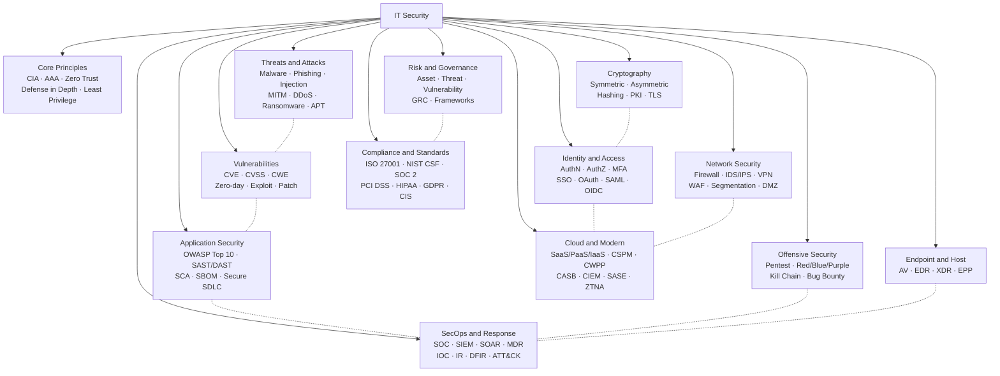

# Concept Map

Visual overview of the major domains and key terms. The dotted lines are the connections worth memorizing: **identity bridges crypto and cloud; vulnerabilities live where threats meet apps; SecOps consumes outputs from almost every other domain.**

> Mermaid renders natively in Obsidian. Switch to **Reading View** (Ctrl/Cmd-E) to see the diagram.

---
← Back to [[_Home]]
